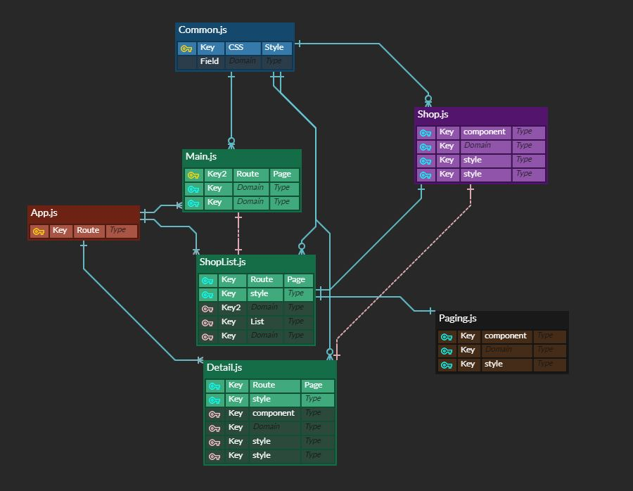

# アプリ名 (Project Name) mesiyaDoko(飯屋 Doko)

### 作者

ジョ ソンイル

## 開発環境

### 環境設定

- npm install

### 対象 OS およびブラウザ(ver.含む)

- Windows10
- Chorme(ver 108.0.5359.72)

### 開発環境/言語

- VisualStudio
- HTML,CSS,JavaScript

### フレームワーク(ver.含む)

- React(ver 18.2.0)(ライブラリー)

#### React ライブラリー(package.json)

- axios(ver 1.1.3)
- react-js-pagination(ver 3.0.3)
- react-router-dom(ver 6.4.3)
- styled-components(ver 5.3.6)

### API

- ホットペッパー グルメサーチ API
- Geolocation API

### 開発期間

- 2022 年 11 月 19 日 ~ 2022 年 12 月 2 日

### 注意事項

韓国に住んでいるため Geolocation API は韓国の位置(緯度、経度)しか確認できませんでした。
ホットペッパー グルメサーチ API は日本の位置（緯度、経度）でのみ正常に動作するため、日本の臨時緯度、経度を指定して開発しました。

## 機能概要

### 機能一覧

- 現在位置取得 : Geolocation API を使用して、現在位置（緯度、経度）を取得する。
- レストラン検索 : 取得した位置(緯度、経度)値を利用して、検索した値とホットペッパーグルメ検索 API を使用して、飲食店詳細情報を取得する。
- 距離間条件 : ホットペッパーで提供した範囲 5 つの条件を使用して、ボタンクリック時に条件範囲で検索をする。

### Commit Convention

- feat: 新機能の追加
- fix: エラーおよびバグ修正
- docs: 文書修正
- style: Page Layout 設定, CSS
- refactor: 機能変更なしにコード修正
- chore: build 業務の修正、package マネージャーの修正など、
- remark: 注釈追加

#### 不具合またその対処

Geolocation API を利用して npm start 実行時、

- localhost のようなローカルサーバードメインで動作
- http:// プロトコル環境では Geolocation API 不動作
  http:// ではなく https:// 必要

#### テーブル定義(ER 図)などの設計ドキュメント

